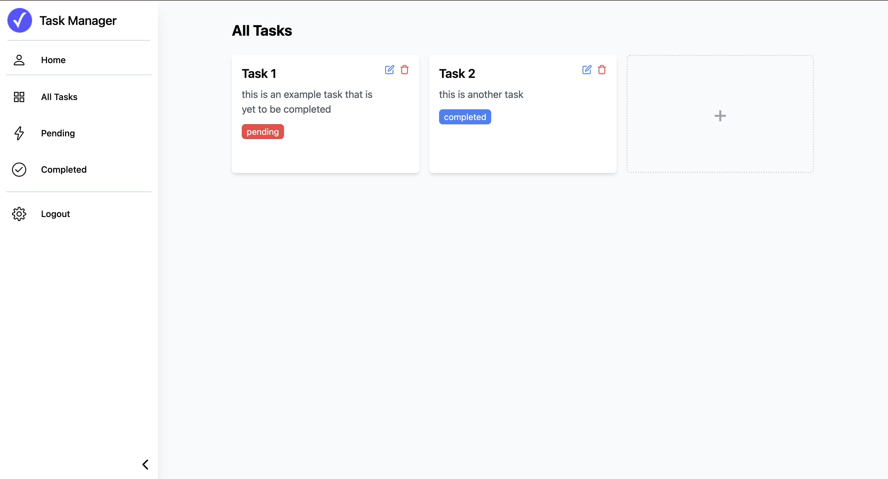

# Task Manager

## Project Overview

The Task Manager Application is a full-stack web application designed to help users efficiently manage their tasks. Built with a modern tech stack, it offers a seamless experience for task creation, editing, and deletion, all secured through robust authentication and authorisation techniques.

---

## Features

- **User Authentication & Authorisation**: Secure user registration and login using JSON Web Tokens (JWT) to ensure that only authenticated users can access and manage their tasks.
- **Task Management**: Authenticated users can view, create, edit and delete tasks.
- **Responsive Design**: A user-friendly interface that adapts to various screen sizes, ensuring accessibility across devices.

---

## Technology Stack

- **Backend**: Node.js, Express
- **Frontend**: React, Tailwind
- **Database**: MySQL
- **ORM**: Sequalize (for managing database operations)
- **Authentication**: JWT

---

## API Documentation

### 1. **POST /users/register**

**Description**: Register a new user.

**Payload**:

```json
{
    "first_name": "example",
    "email": "example@outlook.com",
    "password": "example123"
}
```

### 2. POST /users/login

**Description**: User login.

**Payload**:

```json
{
    "email": "example@outlook.com",
    "password": "example123"
}
```

### 3. GET /users

**Description**: Retrieve all the users from the database.

**Response**:

```json
[
    {
        "id": 1,
        "first_name": "example",
        "email": "example@outlook.com",
        "createdAt": "2024-09-04T20:44:29.000Z",
        "updatedAt": "2024-09-04T20:44:29.000Z"
    },
    {
        "id": 2,
        "first_name": "example2",
        "email": "example2@hotmail.com",
        "createdAt": "2025-02-07T14:49:32.000Z",
        "updatedAt": "2025-02-07T14:49:32.000Z"
    }
]
```


### 4. DELETE /users/:id

**Description**: Delete an illness by ID.

**Response**:

```json
{
    "message": "User deleted successfully"
}
```

### 5. POST /tasks

**Description**: Creates a new task for the logged in user (requires JWT token in the header).

**Payload**:

```json
{
    "title": "Task1",
    "description": "This is a task",
    "status": "completed"
}
```

### 6. GET /tasks

**Description**: Retrieves all tasks belonging to the logged in user (requires JWT token in the header).

**Response**:

```json
[
    {
        "id": 1,
        "title": "First Task",
        "description": "This is my first task",
        "status": "pending",
        "userId": 1,
        "createdAt": "2024-09-04T20:45:40.000Z",
        "updatedAt": "2024-09-04T20:45:40.000Z"
    },
    {
        "id": 2,
        "title": "Read",
        "description": "Read my book",
        "status": "completed",
        "userId": 1,
        "createdAt": "2024-09-04T20:46:01.000Z",
        "updatedAt": "2024-09-04T20:46:01.000Z"
    }
]
```

### 7. GET /tasks/completed

**Description**: Retrieves all completed tasks belonging to the logged in user (requires JWT token in the header).

**Response**:

```json
[
    {
        "id": 2,
        "title": "Read",
        "description": "Read my book",
        "status": "completed",
        "userId": 1,
        "createdAt": "2024-09-04T20:46:01.000Z",
        "updatedAt": "2024-09-04T20:46:01.000Z"
    }
]
```

### 8. PUT /tasks/:id

**Description**: Updates task using task id (requires JWT token in the header).

**Response**:

```json
{
    "id": 2,
    "title": "Read",
    "description": "read my book 30 pages a day",
    "status": "completed",
    "userId": 1,
    "createdAt": "2024-09-04T20:46:01.000Z",
    "updatedAt": "2025-02-07T15:14:52.992Z"
}
```

### 9. DELETE /tasks/:id

**Description**: Deletes task using task id (requires JWT token in the header).

**Response**:

```json
{
    "message": "Task deleted successfully"
}
```

---

## Future Improvements

- **Due Dates and Reminders**: Enable users to assign due dates to tasks and receive reminders as deadlines approach.
- **Search and Filter Options**: Implement search and filter capabilities to help users quickly locate specific tasks based on criteria such as status, priority, or due date.
- **File Attachments**: Provide functionality for users to attach files or links to tasks, facilitating easy access to relevant documents or resources.

---


